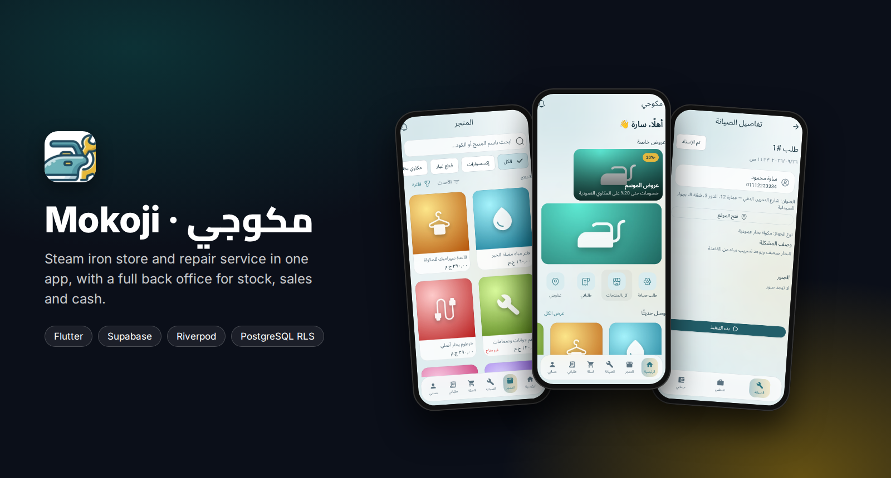
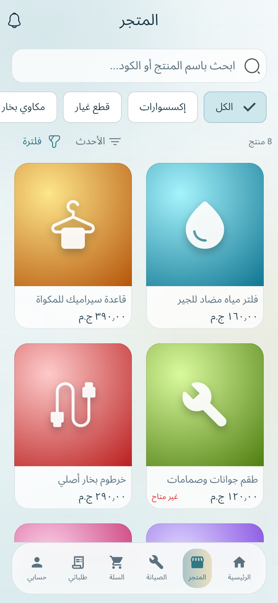
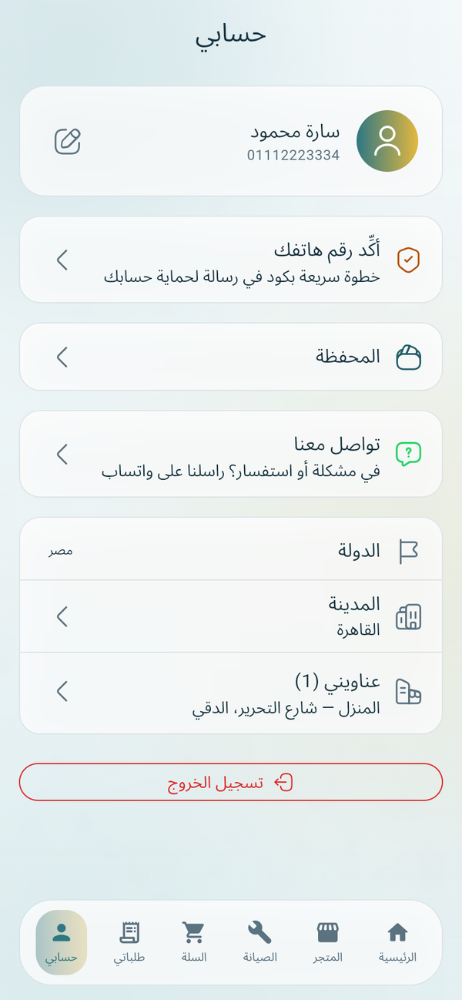
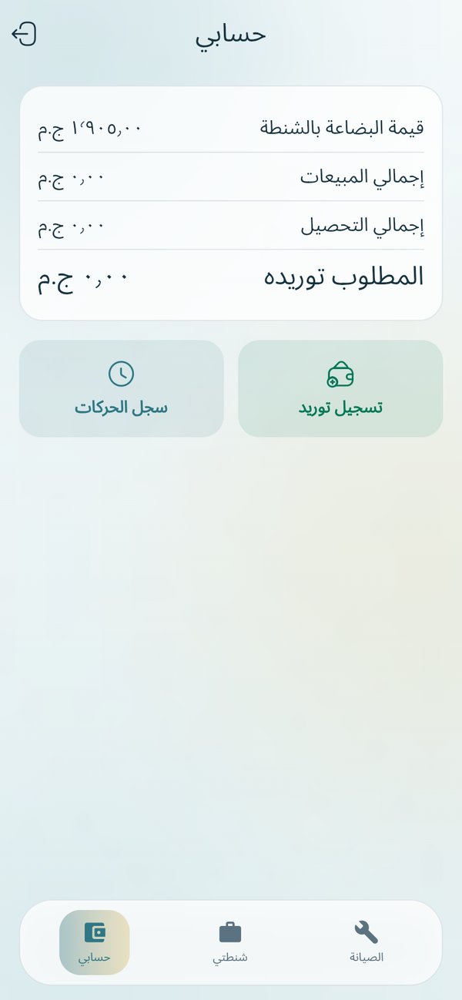
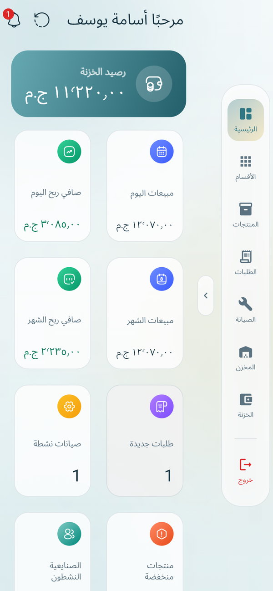

<div align="center">



<br/>

[](https://flutter.dev)
[](https://supabase.com)
[](https://riverpod.dev)
[](#security)
[](#getting-started)

**A steam iron store and repair service in one app, on top of a complete back office.**
Customers shop and request repairs, technicians handle jobs and sell from their own stock,
and the admin runs inventory, sales, cash and reports.

مكوجي — منصة مكاوي البخار: متجر وصيانة للعملاء، فوق نظام إدارة متكامل (مبيعات، مخازن، صيانة، خزنة، وحسابات).

[Screenshots](#screenshots) · [Features](#features) · [Security](#security) · [Tech stack](#tech-stack) · [Getting started](#getting-started)

</div>

---

## Overview

One Flutter app, three roles, one database:

| Role | In the app |
|:--|:--|
| **Customer** | Home with offers, product catalog with filters, cart and checkout, repair requests with a live queue position, order tracking, wallet and account |
| **Technician** | Live list of repair jobs, job details with location, a personal "bag" of stock to sell from, and an account of sales, collections and what is owed |
| **Admin** | Dashboard, categories and products, orders, maintenance, warehouse, cashbox, walk-in sales, reports, users and audit log |

All permissions live in PostgreSQL itself through **Row Level Security**, not in the app code.
Even someone calling the API directly only sees what their role allows.

## Screenshots

> Captured from the running app on a local Supabase instance with sample data.

### Customer

<table>
  <tr>
    <td align="center"><br/><sub><b>Home</b><br/>Offers, banners, shortcuts</sub></td>
    <td align="center"><br/><sub><b>Store</b><br/>Categories, search, filters</sub></td>
    <td align="center"><br/><sub><b>Product</b><br/>Stock status, add to cart</sub></td>
    <td align="center"><br/><sub><b>Repair request</b><br/>Live position in the queue</sub></td>
  </tr>
  <tr>
    <td align="center"><br/><sub><b>My orders</b><br/>Status and total</sub></td>
    <td align="center"><br/><sub><b>Account</b><br/>Wallet, city, saved addresses</sub></td>
    <td align="center"><br/><sub><b>Sign in</b><br/>Email or phone number</sub></td>
    <td></td>
  </tr>
</table>

### Technician

<table>
  <tr>
    <td align="center"><br/><sub><b>Repair jobs</b><br/>Assigned and open requests</sub></td>
    <td align="center"><br/><sub><b>Job details</b><br/>Address, device, problem, start</sub></td>
    <td align="center"><br/><sub><b>My bag</b><br/>Personal stock, sell on site</sub></td>
    <td align="center"><br/><sub><b>Account</b><br/>Sales, collections, amount due</sub></td>
  </tr>
</table>

### Admin

<table>
  <tr>
    <td width="50%"><br/><sub><b>Dashboard</b> · cash balance, daily and monthly sales and profit, active repairs, low stock, customer and technician balances</sub></td>
    <td width="50%"><br/><sub><b>Products</b> · prices, images, featured items and a "repair service" item with a price set at sale time</sub></td>
  </tr>
  <tr>
    <td width="50%"><br/><sub><b>Warehouse</b> · quantities, stock value at cost, receive and issue movements</sub></td>
    <td width="50%"><br/><sub><b>Cashbox</b> · every movement in an append-only log</sub></td>
  </tr>
</table>

<p align="center"><br/><sub>The admin panel on a phone, with a compact side rail</sub></p>

## Features

**Customer**
- Home with offers, banners, featured and new products
- Catalog with categories, Arabic search, price filter and sorting; product options with extra prices
- Cart, saved addresses with map location, checkout with shipping fee approval
- Payments by cash, InstaPay (manual verification) or in-app wallet; refunds back to the wallet
- Repair requests with photos and a live queue position, plus a detailed repair invoice
- Order tracking, notifications (in-app and push), support contact

**Technician**
- Live list of repair jobs; claim, start and complete a job
- A personal bag of stock issued from the warehouse, and sales from the bag
- Repair invoice combining the service and the parts used
- Account of sales, collections and supplies handed in to the cashbox

**Admin**
- Dashboard with the key numbers of the day and the month
- Categories, products, images, options, offers and banners
- Warehouse: receive purchases, issue stock to technicians, inventory counts
- Walk-in sales at the showroom (cash or credit) with partial returns
- Cashbox with deposits, withdrawals and transfers; expenses
- Customer and technician accounts, wallets, reports for any period
- Users and roles, audit log of every operation

## Security

Security is built into the database, not the app:

- **RLS on every table.** Customers see their own data, technicians their own work, admins everything.
- **Sensitive operations only through RPC functions** (`SECURITY DEFINER`). Selling, issuing stock, stock counts and repairs are checked for permission and atomicity before anything is written.
- **Append-only ledgers.** Cash, expenses and stock movements can never be edited or deleted, not even by an admin. Corrections are new reversing entries.
- **Price snapshots.** Every sale stores the price and cost at that moment, so later price changes never rewrite old reports.
- **Private repair photos** in a closed storage bucket, served through short-lived signed URLs.
- **No `service_role` key in the app.** It lives only inside Edge Functions.

## Tech stack

| Layer | Technology |
|:--|:--|
| UI | Flutter, Material 3, full RTL |
| State management | Riverpod 3 with code generation |
| Navigation | `go_router` with a `StatefulShellRoute` per role |
| Models | Freezed, `json_serializable` |
| Database | Supabase / PostgreSQL |
| Access control | Row Level Security on every table |
| Business operations | PostgreSQL RPC functions (`SECURITY DEFINER`) |
| Realtime | Supabase Realtime for orders, repairs and notifications |
| Files | Supabase Storage (private buckets, signed URLs) |
| Maps and location | `flutter_map`, `geolocator` |
| Push | Firebase Cloud Messaging through an Edge Function |

**In numbers:** 46 tables · 55 RPC functions · 74 migrations · 22 feature modules · ~31k lines of Dart.

<details>
<summary><b>Project structure</b></summary>

```
lib/
  core/            theme, navigation, errors, shared utilities
  features/        one folder per module, same layout everywhere:
    <feature>/
      data/          models + repositories
      presentation/  providers + screens + widgets

supabase/
  migrations/      all SQL, applied in numeric order
  functions/       Edge Functions (create-user, send-push, verify-phone-firebase)

docs/              analysis, design and architecture documents
```

| Document | Content |
|:--|:--|
| [`01-system-analysis.md`](docs/01-system-analysis.md) | requirements, roles, permissions, edge cases |
| [`02-database-design.md`](docs/02-database-design.md) | ERD and the reason behind every table |
| [`03-business-logic.md`](docs/03-business-logic.md) | every workflow: sale, issue, repair, count, cash, profit |
| [`04-security-architecture.md`](docs/04-security-architecture.md) | RLS, RPC, storage policies, secrets |
| [`05-flutter-architecture.md`](docs/05-flutter-architecture.md) | why Riverpod, folder layout, routing, realtime |
| [`06-screens-navigation.md`](docs/06-screens-navigation.md) | screen map per role |
| [`07-implementation-roadmap.md`](docs/07-implementation-roadmap.md) | module-by-module plan |
</details>

## Getting started

```bash
flutter pub get
flutter run
```

To point the app at your own Supabase project:

```bash
flutter run \
  --dart-define=SUPABASE_URL=https://xxxxx.supabase.co \
  --dart-define=SUPABASE_PUBLISHABLE_KEY=sb_publishable_...
```

Set up a new database:

```bash
supabase link --project-ref <project-ref>
supabase db push                          # applies every migration in order
supabase functions deploy create-user
```

Then create the first admin account as described in the comment at the top of
[`0013_seed.sql`](supabase/migrations/0013_seed.sql).

Release builds:

```bash
flutter build apk --release        # Android
flutter build windows --release    # Windows
flutter build web --release        # Web
```

## Rules the codebase follows

1. No direct `INSERT` / `UPDATE` from Flutter on any ledger table (`stock_movements`, `cash_transactions`, `*_account_transactions`, `audit_logs`, `sale_items`, `order_items`). RPC only.
2. No deletes on ledger tables. Corrections are reversing entries.
3. Every price used in a sale or purchase is stored as a snapshot and never read back from `products`.
4. The `service_role` key appears only inside `supabase/functions/*`.
5. New modules follow [`05-flutter-architecture.md`](docs/05-flutter-architecture.md): no business logic inside widgets.

## Related

- [Mokoji website](https://github.com/osama-Yosef/-Release): the public Next.js site that reads the same catalog and links to the app download.

## Author

**Osama Yosef** · Flutter developer, Cairo

[](https://github.com/osama-Yosef)
[](https://www.linkedin.com/in/osama-yosef-819268319)
[](https://upwork.com/freelancers/~014ebd205ef38ca04c)
[](mailto:osamayosef038@gmail.com)
