<div align="center">

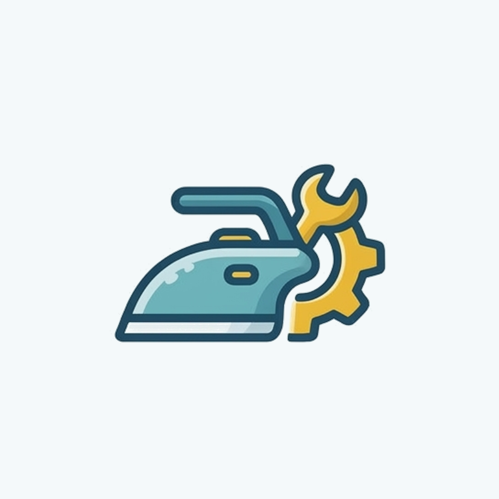

# معرض المدينة المنورة لمكاوي بخار

**نظام ERP متكامل لإدارة معرض أجهزة البخار** — مبيعات، مخازن، صيانة، خزنة، وحسابات، في تطبيق واحد بثلاثة أدوار.

[](https://flutter.dev)
[](https://supabase.com)
[](https://riverpod.dev)
[](#-التشغيل)

</div>

---

## نظرة عامة

نظام إدارة كامل لمعرض متخصص في مكاوي البخار، يغطي دورة العمل من أولها لآخرها:

- **العميل** يتصفّح المنتجات، يطلب، ويفتح طلب صيانة ويتابع دوره لحظة بلحظة.
- **الصنايعي** يستلم طلبات الصيانة، ينفّذها، يبيع من شنطته، ويسدّد حسابه.
- **الأدمن** يدير المخزون والأسعار والخزنة والمصروفات والمستخدمين، ويشوف كل شيء في لوحة تحكم وتقارير.

الصلاحيات كلها مبنية على **Row Level Security** داخل PostgreSQL نفسه — مش في كود التطبيق — يعني حتى لو حد وصل للـ API مباشرة، مش هيشوف غير اللي مسموح له بيه.

<div align="center">

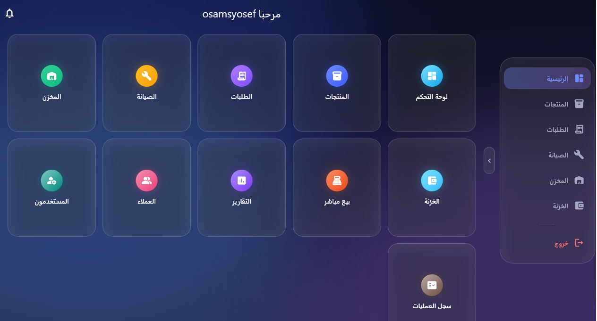

<sub>الواجهة الرئيسية للأدمن — نفس التطبيق يشتغل على أندرويد وويندوز وويب بواجهة تتأقلم مع حجم الشاشة.</sub>

</div>

---

## ✨ المميزات

<table>
<tr>
<td width="33%" valign="top">

### 🛍️ العميل
- تصفّح المنتجات والأقسام
- سلة شراء وطلبات
- طلب صيانة مع صور
- متابعة الدور مباشرة
- فاتورة الصيانة مفصّلة
- حساب وديون
- إشعارات فورية

</td>
<td width="33%" valign="top">

### 🔧 الصنايعي
- قائمة الصيانة الحيّة
- استلام الطلب مباشرة
- شنطة عدة ومخزون
- بيع من الشنطة
- فاتورة صيانة (خدمة + قطع)
- حساب وتوريدات

</td>
<td width="33%" valign="top">

### 📊 الأدمن
- لوحة تحكم ومؤشرات
- منتجات وأقسام وصور
- مخزون واستلام وصرف
- بيع مباشر من المعرض
- خزنة ومصروفات
- حسابات عملاء وصنايعية
- جرد وتقارير وسجل عمليات
- إدارة المستخدمين

</td>
</tr>
</table>

---

## 📸 لقطات الشاشة

### 🖥️ سطح المكتب (ويندوز)

<table>
<tr>
<td width="50%">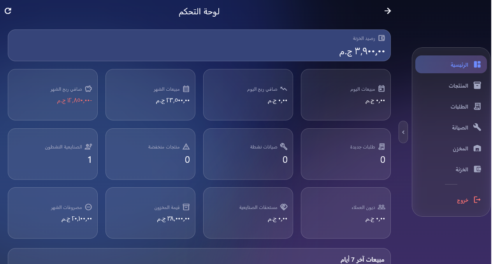<br/><sub><b>لوحة التحكم</b> — رصيد الخزنة، مبيعات وأرباح اليوم والشهر، الصيانة النشطة، المخزون المنخفض، وديون العملاء.</sub></td>
<td width="50%">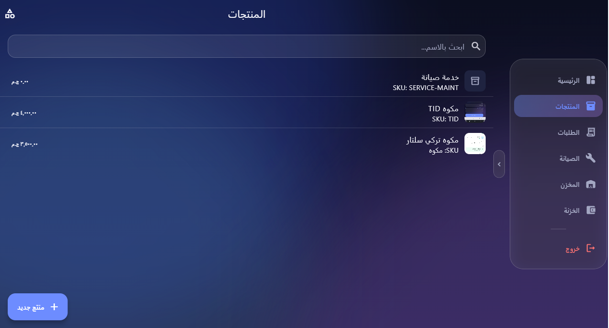<br/><sub><b>المنتجات</b> — إضافة وتعديل المنتجات والأسعار والصور، مع بند «خدمة صيانة» بدون تكلفة وسعر متغيّر.</sub></td>
</tr>
<tr>
<td width="50%">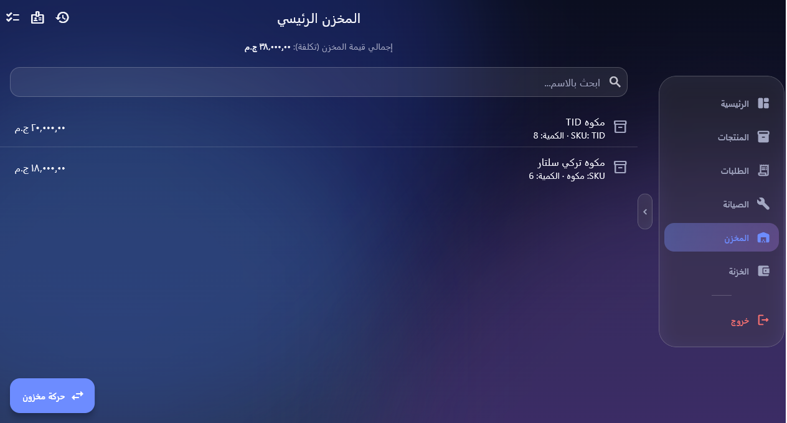<br/><sub><b>المخزن</b> — الكميات وقيمة المخزون بالتكلفة، واستلام/صرف البضاعة بحركات مسجّلة.</sub></td>
<td width="50%">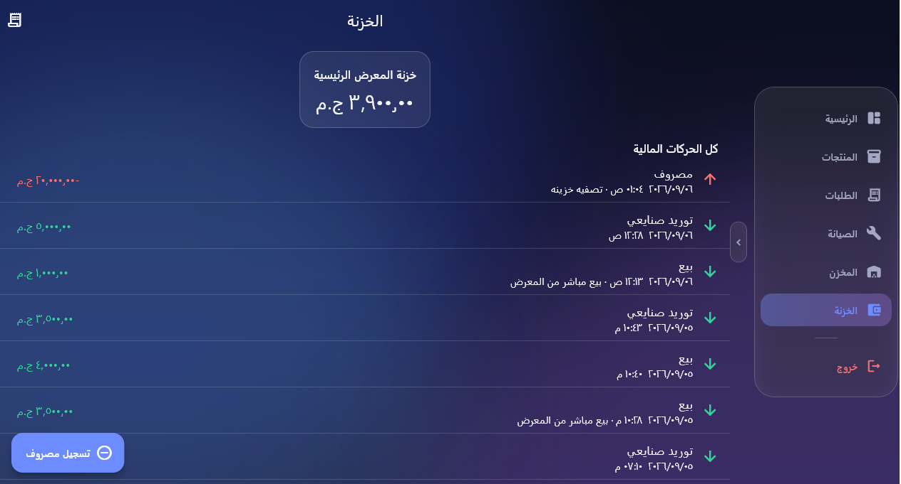<br/><sub><b>الخزنة</b> — كل حركة مالية (بيع، مصروف، توريد صنايعي) في سجل ثابت لا يُعدَّل ولا يُحذَف.</sub></td>
</tr>
<tr>
<td width="50%">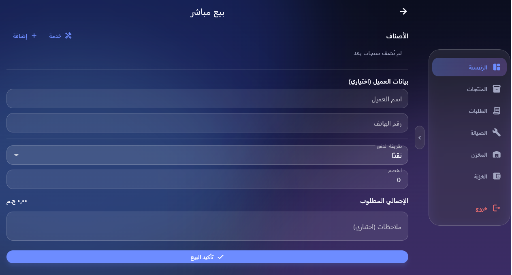<br/><sub><b>بيع مباشر</b> — بيع من المعرض نقدًا أو آجل، مع إمكانية إضافة خدمة بسعر يُحدَّد وقت البيع.</sub></td>
<td width="50%">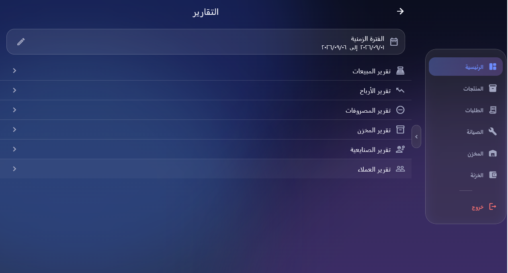<br/><sub><b>التقارير</b> — مبيعات، أرباح، مصروفات، مخزون، صنايعية، وعملاء، على أي فترة زمنية.</sub></td>
</tr>
</table>

### 📱 الموبايل (أندرويد)

<table>
<tr>
<td width="25%">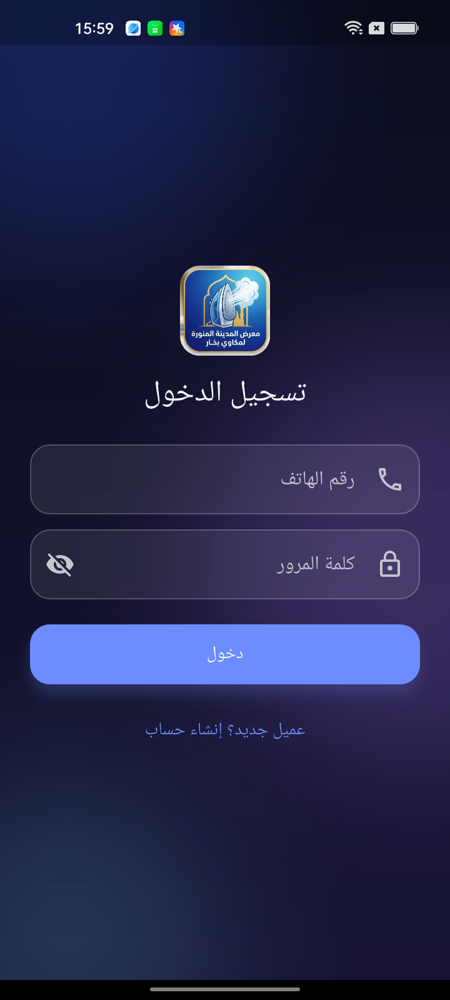<br/><sub><b>تسجيل الدخول</b><br/>برقم الهاتف</sub></td>
<td width="25%">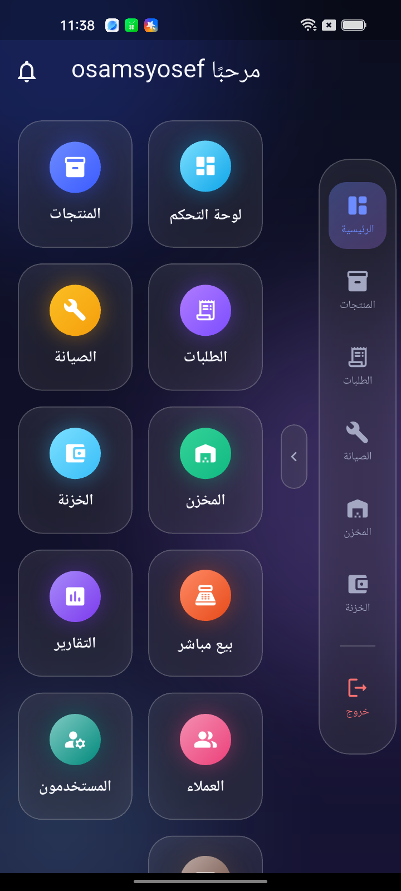<br/><sub><b>رئيسية الأدمن</b><br/>نفس الشاشة بشريط جانبي مضغوط</sub></td>
<td width="25%">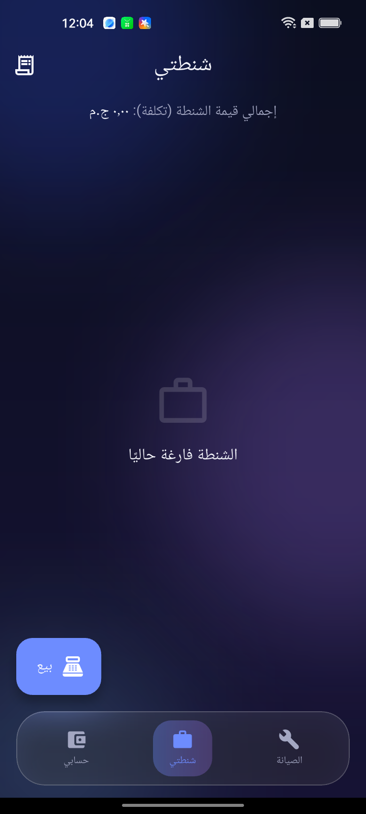<br/><sub><b>شنطة الصنايعي</b><br/>مخزونه الشخصي والبيع منه</sub></td>
<td width="25%">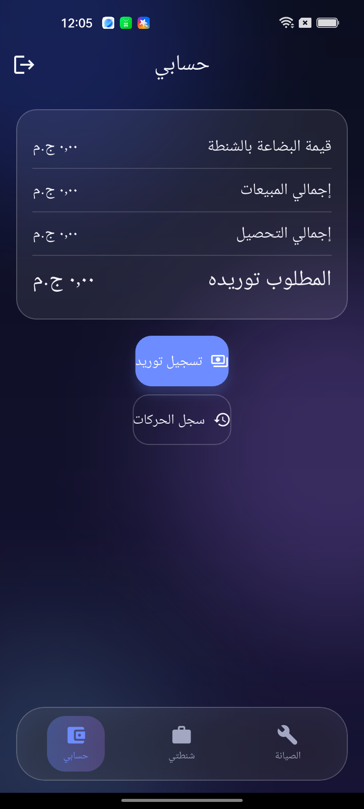<br/><sub><b>حساب الصنايعي</b><br/>المبيعات والتحصيل والمطلوب توريده</sub></td>
</tr>
</table>

---

## 🧱 البنية التقنية

| الطبقة | التقنية |
|---|---|
| الواجهة | Flutter (Material 3، RTL كامل، تصميم Glassmorphism) |
| إدارة الحالة | Riverpod 3 (code-generation) |
| التنقل | go_router — `StatefulShellRoute` لكل دور |
| النماذج | Freezed |
| قاعدة البيانات | Supabase / PostgreSQL |
| الصلاحيات | Row Level Security على كل جدول بدون استثناء |
| العمليات الحساسة | RPC Functions (`SECURITY DEFINER`) |
| اللحظي | Supabase Realtime (الطلبات، الصيانة، الإشعارات) |
| الملفات | Supabase Storage (buckets خاصة + روابط موقّعة) |

**بالأرقام:** 31 جدول · 23 دالة RPC · 27 migration · 17 وحدة (feature) · ~15,300 سطر Dart.

---

## 🚀 التشغيل

المشروع **جاهز للتشغيل فورًا** — مفيش إعدادات ولا مفاتيح تحتاج تضبطها:

```bash
flutter pub get
flutter run
```

> افتح المشروع في Android Studio ودوس **Run** — هيشتغل ويتصل بقاعدة البيانات على طول.

<details>
<summary>التشغيل على مشروع Supabase مختلف</summary>

```bash
flutter run \
  --dart-define=SUPABASE_URL=https://xxxxx.supabase.co \
  --dart-define=SUPABASE_PUBLISHABLE_KEY=sb_publishable_...
```

</details>

<details>
<summary>بناء نسخة للنشر</summary>

```bash
flutter build apk --release        # أندرويد
flutter build windows --release    # ويندوز
flutter build web --release        # ويب
```

</details>

### إعداد قاعدة بيانات جديدة

```bash
supabase login
supabase link --project-ref <project-ref>
supabase db push                        # يطبّق كل الـ migrations بالترتيب
supabase functions deploy create-user
```

بعدها أنشئ أول حساب أدمن كما هو موضّح في تعليق [`0013_seed.sql`](supabase/migrations/0013_seed.sql).

---

## 🔒 الأمان

الحماية مبنية في قاعدة البيانات نفسها، مش في التطبيق:

- **RLS على كل جدول** — العميل يشوف بياناته هو بس، الصنايعي يشوف شغله هو، الأدمن يشوف الكل.
- **العمليات الحساسة عبر RPC فقط** — البيع، الصرف، الجرد، الصيانة… كلها دوال `SECURITY DEFINER` بتتحقق من الصلاحية والذرّية (atomicity) قبل أي كتابة.
- **جداول الحسابات ثابتة (append-only)** — الخزنة والمصروفات وحركات المخزون **مينفعش** تتعدّل أو تتمسح، حتى من الأدمن. التصحيح بحركة عكسية جديدة، عشان الدفاتر تفضل سليمة.
- **الأسعار Snapshot** — كل عملية بتسجّل السعر والتكلفة وقتها، فتغيير سعر المنتج بعد كده مابيأثّرش على التقارير القديمة.
- **صور الصيانة خاصة** — bucket مقفول، والعرض بروابط موقّعة مؤقتة.
- **مفتاح `service_role` مش موجود في التطبيق نهائيًا** — بيعيش جوه Edge Functions بس.

> المفتاح الموجود في الكود هو `publishable key` (المعروف قديمًا بـ anon key) — ده **مصمَّم** ليكون داخل التطبيق، والحماية الحقيقية هي RLS.

---

## 📁 بنية المشروع

```
lib/
  core/            # الثيم، التنقل، الأخطاء، الأدوات المشتركة
  features/        # كل وحدة مستقلة بنفس البنية:
    <feature>/
      data/        #   models + repositories
      presentation/#   providers + screens + widgets

supabase/
  migrations/      # كل الـ SQL، يُطبَّق بالترتيب الرقمي
  functions/       # Edge Functions (create-user)

docs/              # التحليل والتصميم والمعمارية
```

| الملف | المحتوى |
|---|---|
| [`01-system-analysis.md`](docs/01-system-analysis.md) | المتطلبات، الأدوار، الصلاحيات، الحالات الحدّية |
| [`02-database-design.md`](docs/02-database-design.md) | ERD وشرح كل جدول وسبب وجوده |
| [`03-business-logic.md`](docs/03-business-logic.md) | تفصيل كل دورة عمل (بيع/صرف/صيانة/جرد/خزنة/أرباح) |
| [`04-security-architecture.md`](docs/04-security-architecture.md) | RLS، RPC، Storage policies، الأسرار |
| [`05-flutter-architecture.md`](docs/05-flutter-architecture.md) | سبب اختيار Riverpod، هيكل المجلدات، Routing، Realtime |
| [`06-screens-navigation.md`](docs/06-screens-navigation.md) | خريطة الشاشات لكل دور وتدفقات التنقل |
| [`07-implementation-roadmap.md`](docs/07-implementation-roadmap.md) | خطة التنفيذ Module by Module |

---

## ⚖️ قواعد لا تُكسَر

1. لا `INSERT/UPDATE` مباشر من Flutter على أي جدول ledger (`stock_movements`, `cash_transactions`, `*_account_transactions`, `audit_logs`, `sale_items`, `order_items`) — عبر RPC فقط.
2. لا حذف على أي جدول ledger — التصحيح بحركة عكسية جديدة.
3. كل سعر يُباع أو يُشترى به يُسجَّل Snapshot وقت العملية، ولا يُقرأ من `products` الحالي.
4. `service_role key` لا يظهر إلا داخل `supabase/functions/*`.
5. أي وحدة جديدة تتبع البنية في [`05-flutter-architecture.md`](docs/05-flutter-architecture.md) — لا Business Logic داخل الـ Widgets.

---

<div align="center">
<sub>مبني بـ Flutter و Supabase</sub>
</div>
